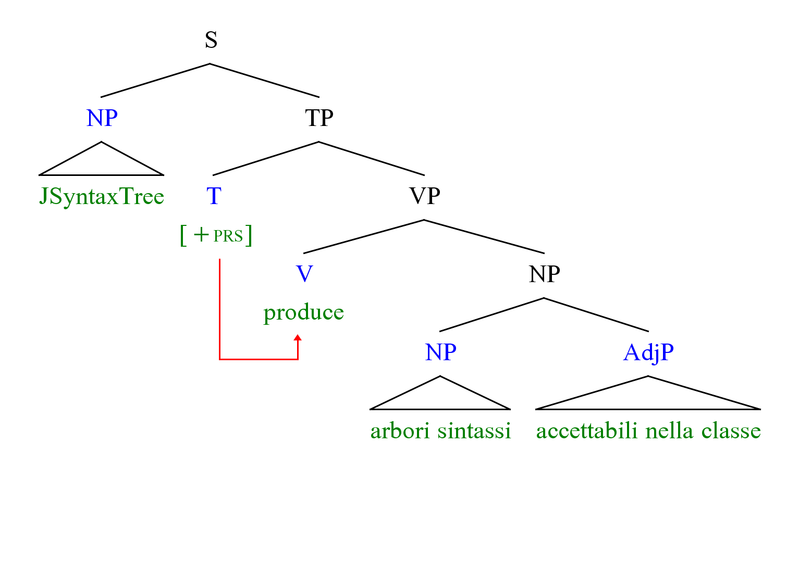

# JSyntaxTree



[Scarica qui](https://github.com/Agilulfulus/JSyntaxTree/releases)

Questo è un programma minimale per aiutare nella construzione degl'alberi sintassi, con rilevanza alla classe mia morfologica.

È basi del programma [RSyntaxTree](https://github.com/yohasebe/rsyntaxtree) da [yohasebe](https://github.com/yohasebe) - l'ho usato molto ma sfortunadamente diventava ch'è necessario di creare una nuova cosa perche le caratteristiche volute aumentano sulle capabilità di suo programma.

# Opzioni CLI

```
Syntasso	Predef		Descrizione
-i <STRING>	-		percorso al file del testo
-o <STRING>	OUTPUT.png	percorso al file risultato (include il estensione di file)
-f <STRING>	Doulos SIL	nomme del font
-fs <INT>	48		taglia per font
-l <FLOAT>	3.0		taglia per il tratto (delle linee)
-sx <INT>	50		spazio entre i nodi vicini orizzontalmente
-sy <INT>	150		spazio entre i nodi vicini verticalmente
-c		-		construe l'arboro con colore
-q		-		usci quando è finita la generazione - non crea una finestra
-b <INT>	50		taglia per il spazio attorno l'arboro
-a		-		pedice-automatico - porrà un pedice numerale alli tipi di nodi uguali
```

# Sintasso del Movimento

Movimento è una cosa tan semplice: sempre ha una "movimento" alla sinestra, però è possibile di cambiare la direzione con un numero negativo.

Il sintasso basico segue:

```
...
[NODO^1 valore]
...
```

L'operatore `^` (senza spazi) indica che'l movimento origine al questo nodo, e muove su `1` altri nodi alla sinestra. Puoi cambiare il numero a qual numero desiderato ma è necessario che esiste un nodo a cui può muovere. Puoi duplicare anche l'operatore così:

```
...
[NODO^1^2^3 valore]
...
```

Il questo sintasso fa che tre designazioni individuali per movimenti muovono su `1`, `2`, e `3`, nodi alla sinestra.

```
...
[NODO^1,2 valore]
...
```

Avere due numeri con l'operatore che sono separati per una comma indica che il movimento accade all'uno degli nodi parenti. Qui con `^1,2`, il sintasso indica che se muove a `1` nodo alla sinestra, e s'aumenta all'un nodo `2` parenti su. Così è possibile d'avere nodi ultimi con sub-nodi (Guarda a [../Examples/chomsky.txt](../Examples/chomsky.txt) per un esempio funzionale).

Com'è detto previosamente, negare il valore movimento crearà una designazione nell'altra direzione. Allora, se vuoi indicare movimente alla destra, devi porre l'operatore `^` alla nodo 'ultimo' e usi `-x`.

```
...
[NODO^-1,2 value]
...
```

# Sintasso di Testo

Generalmente [Labelled Bracket Notation](DOCS/IntroductionToBracketNotation.md), con un po' d'effetti per testi:

`\n` newline

`[TYPE value 1\nvalue 2]`


`_WORDS_` subscript

`[TYPE_SUBTYPE_]`


`*WORDS*` bold

`[TYPE *value*]`


`%WORDS%` italic

`[TYPE %value%]`


`$WORDS$` smaller font

`[TYPE BIG$SMALL$]`


`@WORDS@` underline

`[TYPE @value@]`


`#WORDS#` highlight

`[TYPE #value#]`


Alla fine d'un nodo, i.e. il `@` nel `[N value value@]`, è possibile di porre queste addizioni di determinare la forma del tratto connesso:

`^` triangolo

`[TYPE value^]`


`|`	un tratto attuale

`[TYPE value|]`


Se hai bisogno di più d'una parola nel segno, usa il ` vicino le parole.

Senz'altro, tutte delle combinazioni sono accettabili.

(e.g. `$*%_P_A_R_O_L_E_%*$`)

Il programma usa per il font predefinito Duolos SIL (https://software.sil.org/doulos/), allora è necessario che hai scaricato questo. Non so il font predefinito usato per Java.

Adesso esiste un GUI po' malo ho creato per l'uso di cui non vogliano usare il terminal.